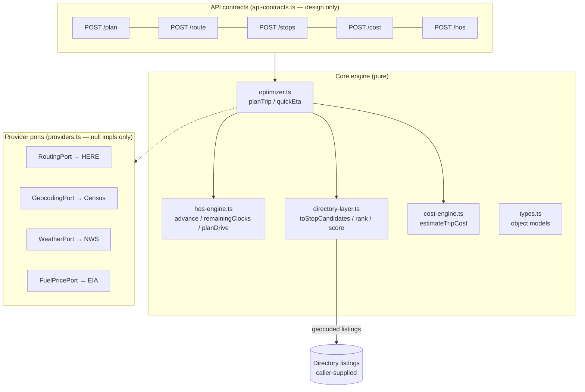
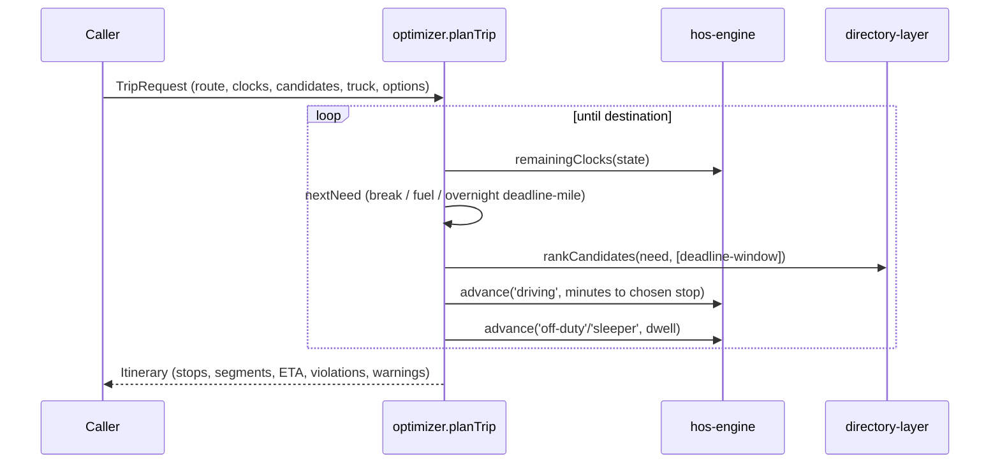

# Trip Planner Core Engine (Phase 3)

Offline, pure-TypeScript planning engine under `src/lib/trip-planner/`. No
network I/O, no database access, no UI — every module is deterministic
(same inputs → same plan) and fully testable with the esbuild runner.

## Architecture

## Planning flow

## Object models (`types.ts`)

- **TruckProfile** — dimensions, weight, hazmat class, tank, mpg, fuel
  safety factor.
- **Route / RouteLeg** — caller-supplied legs (distance, avg speed,
  optional per-state miles + toll cents). `buildRoute` computes totals.
- **StopCandidate** — a geocoded directory listing projected onto the route
  (route-mile + off-route miles) with parking/amenity/provenance signals.
- **PlannedStop** — kinds: origin, pickup, delivery, destination, **fuel**,
  **break**, **overnight**, **parking**, **weather**, custom; each carries
  arrival/departure times, dwell, reason, duty status, and alternates.
- **ClockState / DutySegment / RemainingClocks / HosViolation** — HOS state.
- **CostInputs / TripCostEstimate** — cost components; unknown inputs stay
  null (no invented figures).

## HOS engine (`hos-engine.ts`)

49 CFR 395.3 property-carrying rules, planning mode (explicitly **not an
ELD**): 11-hour driving; 14-hour window (never paused); 30-minute break
after 8h cumulative driving (any ≥30-min non-driving period satisfies it);
10-hour reset; 60/7 and 70/8 rolling cycles via day buckets; 34-hour
restart. Key entry points:

| Function | Purpose |
|---|---|
| `freshClockState(atMs, rule)` | State after a full reset |
| `advance(state, status, minutes)` | Simulate one duty segment → new state + violations |
| `remainingClocks(state)` | 11/14/break/cycle remaining + binding constraint |
| `legalDrivingMin(state)` | Minutes legally drivable right now |
| `planDrive(state, driveMin)` | Auto-inserts 30-min breaks + 10-hr resets → violation-free schedule |
| `earliestArrivalMs(...)` | Arrival-time calculation |
| `validateClockState(state)` | API-boundary validation |

Split-sleeper pairing (§395.1(g)) is deliberately Phase 4+ (per the Phase 1
architecture decision).

## Directory integration (`directory-layer.ts`)

`toStopCandidates(listings, routePoints)` consumes **geocoded** listings
(rows without coordinates are dropped — the Stage backfills feed this),
projects them onto the route, and normalizes signals. `scoreCandidate`
implements the truck-stop scoring algorithm — deterministic, component-wise
explainable: category fit, coordinate provenance (manually-verified >
machine-checked > unknown), parking capacity tiers, overnight/reservable
signals, need-relevant amenities, preferred-brand boost, off-route penalty.
`rankCandidates` / `recommendFuelStops` / `recommendParking` return ranked
lists with score breakdowns.

## Cost engine (`cost-engine.ts`)

Fuel gallons (miles ÷ mpg), fuel cost (only when a price is supplied — the
EIA port or manual entry; never invented), tolls (explicit total → per-mile
estimate → unknown), overnight parking, fixed daily costs, driver pay,
totals, cost-per-mile, per-day breakdown. Any unknown component keeps the
total null with an explanatory note.

## Optimizer (`optimizer.ts`)

`planTrip` walks the route: computes the next **need event** (30-minute
break due, fuel safety range reached, 11/14 clock exhaustion), searches the
`stopSearchWindowMiles` window before the deadline, selects the top-ranked
candidate (preferred stops via brand/category boosts), records alternates,
and advances the HOS clocks through the stop. Fuel stops ≥30 min double as
break-clock resets (2020 rule). Thin-coverage corridors produce a virtual
stop + warning instead of a silent gap. `quickEta` gives HOS-correct
arrival quotes without stop selection.

## Provider ports (`providers.ts`)

Interfaces + null implementations only: `RoutingPort` (HERE v8 truck
routing shape), `GeocodingPort` (re-export of the existing Census adapter
seam), `WeatherPort` (NWS bands + alerts along route), `FuelPricePort`
(EIA diesel cents/gallon). `offlineProviders` is the all-null registry —
the engine runs fully offline with it, which is also how the tests prove
zero network dependencies.

## API contracts (`api-contracts.ts`)

Zod schemas for the five planned endpoints (plan / route / stops / cost /
hos) with typed responses. Design-only in Phase 3 — no route handler
imports them yet.

## Extension points

1. **Live providers (Phase 4):** implement `RoutingPort`/`WeatherPort`/
   `FuelPricePort` with injected fetch (mirror `census-geocoder.ts`).
2. **Split sleeper:** extend `advance`/`planDrive` with §395.1(g) pairing;
   `RemainingClocks` already isolates the binding-constraint logic.
3. **Weather stops:** `PlannedStop.kind = 'weather'` exists; feed
   `WeatherPort.alongRoute` bands into `nextNeed` as deadline events.
4. **Per-state mileage / IFTA:** `RouteLeg.perStateMiles` is carried
   through; a reporting module can aggregate it.
5. **API handlers:** wrap engine calls with the contracts' schemas under
   `src/app/api/trip-planner/*` (Phase 4, auth + rate limits there).
6. **Persistence:** the Phase 1 schema sketch (trips/stops/legs/hos_events)
   maps 1:1 onto these object models when saved-trip sync arrives.

## Live truck routing (`here-routing.ts`, Phase 5)

`createHereRoutingPort(fetchFn, apiKey, opts)` implements the Phase 3
`RoutingPort` seam against HERE Routing API v8 (`transportMode=truck`).
Truck attributes (height/width/length in cm, gross weight in kg, axle
count, hazmat → `shippedHazardousGoods`) ride on every request; geometry
comes back as a flexible polyline (`flexible-polyline.ts`, pure decoder)
and is downsampled into the same `routePoints` shape the estimate produced
— so HOS planning, weather bands, stop/parking candidates, and fuel math
all consume real road data with zero downstream changes.

Rails: server-side only (`HERE_API_KEY` env; no URL or key ever escapes
the adapter — every failure returns `null`); one retry on 5xx/network,
none on 4xx; per-instance TTL cache (default 6 h) so repeat anchor-pair
quotes cost zero transactions; per-instance hourly call cap (default 100)
keeps usage inside the approved free tier. `composeQuote` runs the port
under a hard time budget and falls back to the labeled estimate with a
warning whenever the port answers null. Split-sleeper remains deferred.

## Free-text origin/destination search (`here-geocode.ts`, `place-search.ts`)

Drivers can enter any city+state, street address, ZIP, or directory location
for origin and destination — not only directory stops. `createHereGeocodePort`
implements a `GeocodePort` seam against HERE Geocoding & Search v7
(`/geocode`, US-constrained), returning validated coordinate matches; items
with missing or out-of-range coordinates are dropped so malformed coordinates
never reach the router. `place-search.ts` merges two suggestion sources into
one labeled list: directory anchors (filtered offline/instantly, badged
"Directory") and HERE matches (badged City/Address/ZIP/Place/Region),
de-duplicated by rounded coordinate.

`GET /api/trip-planner/places?q=` serves HERE matches server-side (key never
leaves the server), rate-limited (30/min/IP) with the same cost rails as
routing: per-instance hourly cap, TTL cache, one retry on 5xx (never 4xx),
fail-soft to `[]`. The `PlaceCombobox` UI resolves a free-text pick to
coordinates, which flow through the **unchanged** quote endpoint — so HERE
truck routing, HOS, weather, cost, parking, and stop planning are untouched.
Selection is explicit (editing clears a prior pick), same-point and empty
submissions are rejected, and directory-to-directory trips still work when
geocoding is unavailable. Split sleeper remains deferred.

## Saved Trips & Recent Searches (local-device MVP)

DECISION GATE: tlws-platform has no end-user account system — Supabase Auth is
admin-only ("No public sign-up — admins are provisioned by the owner"), there
is no public driver sign-up and no stable per-driver user ID, and the Trip
Planner is a public/anonymous tool. Per the milestone spec, saved trips are
therefore a LOCAL-DEVICE MVP (versioned localStorage), not an account feature.
No second auth system was introduced; no server persistence exists.

`saved-trips-store.ts` is a PURE, versioned store (`tlws:trip-planner:v1`):
recent place selections (10), planned-trip history (10), favorite routes (20),
and truck presets (10). It handles fail-soft parsing, schema versioning +
migration (v0 → v1; corrupt/unknown → empty), stale cleanup (recents/planned
older than 90 days dropped; favorites/presets kept as explicit user data),
de-duplication (recents by coord, favorites/planned by route, presets by name),
and caps — all offline-testable (`scripts/test-saved-trips.ts`). Objects are
rebuilt field-by-field on load, so a hostile localStorage blob cannot pollute
prototypes or inject fields.

`useSavedTrips` is an SSR-safe hook (first render matches server; localStorage
touched only in an effect) that fail-softs when storage is blocked (private
mode) to in-memory state. `SavedTripsPanel` renders favorites (re-plan /
rename / delete-with-confirm), truck presets (apply / delete), recent-search
controls (clear), an explicit private-device notice, and empty/loading/
unavailable states — all keyboard-accessible. "Save this trip" is explicit
(never auto-saved); recent selections and planned-trip history are recorded
device-locally and never uploaded. The quote pipeline (HERE routing, HOS,
weather, cost, parking, fuel, fallback) is unchanged — re-plan simply feeds
saved coordinates + truck back through the same POST /api/trip-planner/quote.

A cloud-sync layer can adopt these same shapes once end-user auth exists (see
the milestone's cloud-sync planning report).

## Cloud sync for saved trips (End-User Accounts milestone)

Signed-in drivers sync their **saved trips + truck presets** across devices;
**recent searches never leave the device**. Signed-out users keep the exact
local-only behavior with zero cloud requests. Cloud sync never blocks route
planning — any failure degrades to a visible status and the local store.

- **Auth**: public email-OTP via Supabase (`useCloudSync`), a plain Supabase
  session entirely separate from the admin password/HMAC/admin-routes system.
  No account is required to use the planner.
- **Migration 044** (`saved_trips`, `truck_presets`): additive, idempotent,
  owner-scoped RLS (`auth.uid() = user_id` on SELECT/INSERT/UPDATE/DELETE),
  `user_id` → `auth.users`, `unique(user_id, client_id)` for idempotent
  upsert, indexes on `user_id` and `(user_id, updated_at)`. Anon revoked.
- **API** (`/api/trip-planner/cloud/{saved-trips,truck-presets}`): session-
  bound (RLS + explicit session user_id, never from the body), Zod-validated,
  item-capped, rate-limited; the service role is never used.
- **Sync** (`cloud-sync.ts`, pure + tested): client `id` = cross-device
  `client_id`; first sign-in UNION-merges (client-id dedup, name+coord
  fallback, newest-updatedAt wins for a clearly-same item, distinct records
  both preserved, never deletes local); an offline op-queue (per-user key)
  retries on reconnect, dedupes (delete supersedes upsert), and survives
  partial sync. Sign-out clears local cloud-backed data for cross-user
  isolation. Server `updated_at` (trigger) is the sync authority, sidestepping
  client clock skew.

OWNER ACTIVATION (two steps, both owner actions — not done here):
1. Apply migration 044 to production (creates the two tables + RLS).
2. Ensure Supabase Auth email/OTP delivery is configured (SMTP + email
   sign-ups enabled) so the sign-in code emails send.
Until both are done, sign-in/sync fail-soft and the planner + local store work
exactly as today.

## HOS exception architecture (`hos-exceptions.ts`)

`HOS_CAPABILITIES` is the auditable regulatory surface: every implemented rule
(11-hour §395.3(a)(3)(i); 14-hour wall-clock window §395.3(a)(2); 30-minute
break §395.3(a)(3)(ii); 10-hour reset §395.3(a)(1); 60/70-hour cycles
§395.3(b); 34-hour restart §395.3(c)) and every unsupported provision with the
conservative assumption the planner makes instead. Unsupported provisions are
typed assessments, never silence: `assessSplitSleeper` (§395.1(g)(1)),
`assessAdverseDriving` (§395.1(b)(1)), and `assessShortHaul` (§395.1(e)(1))
return discriminated unions carrying the citation, the reason, and the
conservative guidance — a future implementation replaces the body without
changing call sites. `recapProjection` IS implemented (pure §395.3(b)
arithmetic): minutes rolling off the cycle window and projected availability
for each coming day, verified against the engine's own day-bucket roll.
Planning mode only — not an ELD, no record of duty status.

Hardening suite (`scripts/test-hos-hardening.ts`): exact boundary minutes for
every clock (660/661, 840/841, 480/481, 599/600, 2039/2040), DST
spring-forward/fall-back and midnight-rollover invariance (epoch-ms math),
invalid-sequence and clock-skew rejection, stale multi-day gaps, and 300
seeded random duty sequences holding all clock invariants.
